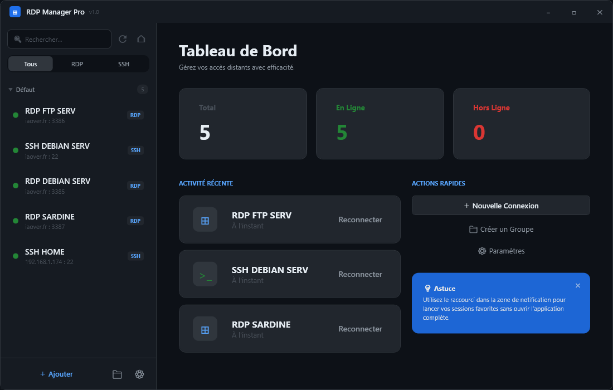
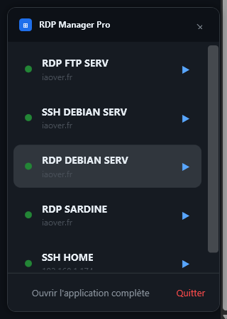

# 🚀 RDP Manager Pro

<p align="center">
  
</p>

<p align="center">
  <strong>Gestionnaire moderne de connexions distantes RDP et SSH pour Windows</strong><br>
  Développé en <strong>WPF / C# / .NET Framework 4.8</strong>
</p>

<p align="center">
  <a href="https://github.com/OVER-AI-DOMOTIQUE/RdpManagerPro">
    
  </a>
  <a href="https://iaover.fr">
    
  </a>
  
  
  
  
</p>

---

## ✨ Présentation

**RDP Manager Pro** est une application **Windows WPF** pensée pour centraliser et simplifier la gestion des connexions **RDP** et **SSH** dans une interface moderne, rapide et élégante.

L’objectif est simple : offrir une expérience plus propre, plus fluide et plus efficace pour gérer plusieurs accès distants au quotidien, que ce soit pour des serveurs, des machines locales ou des environnements d’administration.

---

## 🧩 Fonctionnalités

- 🖥️ Gestion centralisée des connexions **RDP**
- 🔐 Gestion centralisée des connexions **SSH**
- 🌙 Interface moderne avec **thème sombre**
- 📊 **Tableau de bord** avec résumé des connexions
- 🔎 **Recherche rapide** des accès enregistrés
- 🏷️ **Filtrage** par protocole
- 🕘 **Activité récente** avec actions de reconnexion
- ⚡ **Actions rapides** depuis l’interface principale
- 📌 Accès compact via la **zone de notification**
- 📂 Organisation claire pour retrouver rapidement ses machines

---

## 🖼️ Captures d’écran

### 🪟 Fenêtre principale

<p align="center">
  
</p>

### 📎 Fenêtre compacte

<p align="center">
  
</p>

---

## 🎯 Objectif du projet

**RDP Manager Pro** a pour but de proposer un gestionnaire de connexions distantes moderne sur Windows avec :

- ✅ une interface intuitive
- ✅ un accès rapide aux connexions
- ✅ une meilleure lisibilité
- ✅ une expérience plus professionnelle
- ✅ une base évolutive pour ajouter de nouvelles fonctionnalités

---

## 🛠️ Technologies utilisées

- 💻 **C#**
- 🪟 **WPF**
- 🎨 **XAML**
- ⚙️ **.NET Framework 4.8**

---

## 🏗️ Structure du projet

```text
RDPManager/
├── Converters/
├── docs/
├── Models/
├── Properties/
├── Resources/
├── Services/
├── ViewModels/
├── App.xaml
├── App.xaml.cs
├── MainWindow.xaml
├── MainWindow.xaml.cs
├── TrayFlyout.xaml
├── TrayFlyout.xaml.cs
├── RDPManager.csproj
└── README.md

```

---

## 📥 Installation

### ✅ Prérequis

- Windows
- Visual Studio 2022 ou version compatible
- .NET Framework 4.8

### 📦 Cloner le dépôt

```bash
git clone https://github.com/OVER-AI-DOMOTIQUE/RdpManagerPro.git
```

### ▶️ Lancer le projet

1. Ouvrir le projet dans Visual Studio
2. Restaurer les dépendances si nécessaire
3. Compiler le projet
4. Exécuter l’application

---

## 🧪 Utilisation

Avec **RDP Manager Pro**, vous pouvez :

- 🔍 rechercher une connexion
- 🖥️ afficher vos accès RDP
- 🔐 afficher vos accès SSH
- ⚡ reconnecter rapidement une session
- 📌 ouvrir une vue compacte depuis la zone de notification
- 📊 consulter l’activité récente et le tableau de bord

---

## 🛣️ Roadmap

Fonctionnalités prévues pour les prochaines versions :

- ➕ ajout / modification / suppression complète des connexions
- ⭐ système de favoris
- 📁 gestion avancée des groupes
- 🔒 stockage sécurisé des identifiants
- 🌐 test automatique de disponibilité des hôtes
- 📤 import / export de configuration
- 🎨 personnalisation du thème
- 🔔 améliorations de la zone de notification
- 🧠 options avancées de gestion et d’automatisation

---

## 📌 Statut du projet

🟢 **Projet en cours de développement**

---

## 🤝 Contribution

Les suggestions, idées et contributions sont les bienvenues.

### Étapes de contribution

```bash
git checkout -b feature/ma-fonctionnalite
git add .
git commit -m "Ajout de ma fonctionnalité"
git push origin feature/ma-fonctionnalite
```

Puis ouvrez une **Pull Request** sur GitHub.

---

## 🔗 Liens utiles

<p align="center">
  <a href="https://github.com/OVER-AI-DOMOTIQUE/RdpManagerPro">
    
  </a>
  <a href="https://iaover.fr">
    
  </a>
</p>

---

## 👨‍💻 Auteur

**OVER-AI-DOMOTIQUE**

🌐 Site officiel : **[iaover.fr](https://iaover.fr)**

---

## 📄 Licence

Ce projet est distribué sous licence **MIT**.  
Voir le fichier [LICENSE](LICENSE).